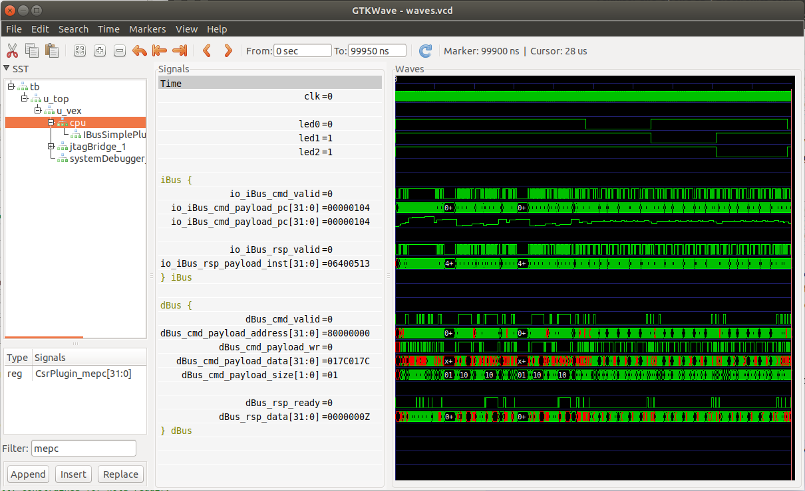

# VexRiscv and OpenOCD Example Repo

This repo contains the example project that goes with my [VexRiscv and OpenOCD](https://tomverbeure.github.io/2021/07/18/VexRiscv-OpenOCD-and-Traps.html)
blog post.

The example design contains a small VexRiscv CPU system.

## VexRiscv Configuration

**CPU Configuration**

The VexRiscv can be configured into a thousand different ways. The exact details
of the configuration parameters can be found in 
[`VexRiscvWithDebug.scala`](spinal/src/main/scala/cpu/VexRiscvWithDebug.scala).

A short summary is:

* 5-stage pipeline configuration for a good trade-off between clock speed and area
* Debug feature enabled
* Compressed instructions support for optimal instruction RAM usage.
* No HW multiplier/divide support to save on FPGA resources.
* 64-bit RISC-V cycle counter support.
* trap on EBREAK enabled

    This is not necessary for basic debug support, but it will be useful for semi-hosting
    support. See later.

**Dual-ported CPU Memory**

In many FPGAs, all block RAMs are true dual-ported, and there's no extra cost to use them.
The VexRiscv has a traditional Harvard architecture with separate instruction and data bus.

In this design, I use one port of the RAM for the CPU instruction bus, and the other port 
for the CPU data bus.  This removes the need for arbitration logic that selects between iBus or
dBus requests to memory, because they can happen in parallel.

The 32-bit memory is implemented with 4 8-bit wide RAMs, one for each byte lane. This way, 
I don't rely on the synthesis tool having to infer byte-enable logic...

**Peripheral registers**

The peripheral section contains 1 control register to set the LED values, and 1 status
register to read back the value of a button.

There's also a status bit that indicates whether or not the CPU is running on real
HW or in simulation. I use this bit for cases when I want the same SW image to behave
slightly different between FPGA and testbench. In this case, I use to change
the speed at which LEDs toggle. 

**No interrupts or external timer**

The CPU is generated with external and timer interrupt support enabled, but the inputs
are strapped to 0 in this minimal example.

## Software

The `./sw` and `./sw_semihosting` directory contain the firmware for the CPU. 

Assuming a RISC-V GCC toolchain can be found in the right location, just run 'make' to compile.

## RTL Software Selection

The RTL picks up the firmware to load into the RAM either from `./sw` or `./sw_semihosting`, based on
whether or not the `SEMIHOSTING_SW` define is provide on the simulator command line.

## Simulating the Design with Icarus Verilog

The `./tb` directory contains a pure Verilog testbench to flush out functional issue.  

While not self-checking, it was very useful in tracking down 
[a bug](https://github.com/SpinalHDL/VexRiscv/issues/176) in the VexRiscv DebugPlugin that has since been fixed.

It uses the open source Icarus Verilog to simulate the design, and GTKWave to watch waveforms. 

In the `./tb` directory, just type `make`:

```sh
iverilog -D SIMULATION=1 -o tb tb.v ../rtl/top.v ../spinal/VexRiscvWithDebug.v
./tb
VCD info: dumpfile waves.vcd opened for output.
               48250: led0 changed to 0
               65250: led0 changed to 1
               65250: led1 changed to 0
               82150: led1 changed to 1
               82150: led2 changed to 0
```

`make waves` will bring up the GTKWave waveform viewer and load the `waves.vcd` file that was created during
the simulation.



The JTAG inputs signals are strapped to a fixed value, since the goal of this testbench was not to check
the debug functionality  but to check that CPU code was fine.  As you can see above, the leds are indeed 
toggling in sequence.

## Simulating the Design with Verilator

There's also a testbench in the `./tb_ocd` directory. The goal of this testbench is to run the CPU
with Verilator (MUCH faster!) but also to link the simulator with OpenOCD. This way, you can connect
GDB to the simulator as if you're connected to a real piece of hardware.

Since we're simulating a VexRiscv, you need to isntall the VexRiscv version of OpenOCD. You can find
it [here](https://github.com/SpinalHDL/openocd_riscv).

The Verilator testbench uses the `sw_semihosting` firmware.

To run the testbench without semihosting activated:

* Build the software in `./sw_semihosting`
* Go the the `./tb_ocd` directory
* Type `make` to build the testbench
* Type `make run` to run the simulation

If you want to dump waveforms, you can set the `TRACE_VCD` or `TRACE_FST` variable in `./tb_ocd/Makefile` to `yes`
before building the testbench.

## Simulating Semihosting

You need 3 terminal windows.

* In window 1, run the Verilator simulation as described above. You should be seeing this:

```
tom@zen:~/projects/vexriscv_ocd_blog/tb_ocd$ make run
./obj_dir/Vtop
BOOT
```

* In window 2, go to `./sw_semihosting` and start OpenOCD: `make ocd_only_sim`. If all goes well, 
  you'll see in window 1 that the openocd is now connected to the simulation:

```
tom@zen:~/projects/vexriscv_ocd_blog/tb_ocd$ make run
./obj_dir/Vtop
BOOT
CONNECTED                       <<<<
```

* In window 3, go to `./sw_semihosting` and start gdb: `make gdb_only`. You see this:

```
tom@zen:~/projects/vexriscv_ocd_blog/sw_semihosting$ make gdb_only
/opt/riscv64-unknown-elf-toolchain-10.2.0-2020.12.8-x86_64-linux-ubuntu14/bin/riscv64-unknown-elf-gdb -q \
	progmem.elf \
	-ex "target extended-remote localhost:3333" \
	-ex "set remotetimeout unlimited"
Reading symbols from progmem.elf...
Remote debugging using localhost:3333
0x00000284 in call_host (arg=0xf30, reason=4) at semihosting.c:47
47	    asm volatile (
(gdb) 
```

Enter 'c' in gdb to continue the program that's running on the simulated CPU.

If you now go to window 2 with openocd, and type characters follwed by Enter, you should see the 
ASCII value of those characters printed back:

```
Hello world!
char: 0.char: 72.char: 101.char: 108.char: 108.char: 111.char: 32.char: 119.char: 111.char: 114.char: 108.char: 100.char: 33.char: 10.
```

IMPORTANT: semihosting calls where the CPU is asking data from the host (e.g. asking keyboard
data from the PC) are blocking, not only for the simulated CPU itself but also for GDB itself.
If you want to stop a running program with GDB by pressing Ctrl-C, and a semihosting call is pending,
you first need to type Enter in the openocd window to unblock the semihosting call and make GDB
process your Ctrl-C request.


